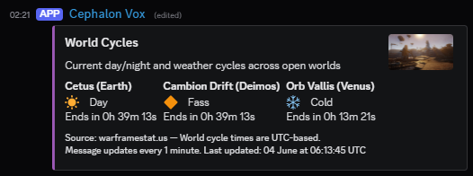
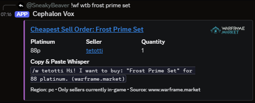

<p align="center">
  
</p>

# Warframe Discord Bot

A lightweight and modular Discord bot for tracking world states, Nightwave, Baro Ki'Teer, void fissures, Warframe Market prices and more. Built with `discord.js` and TypeScript.

Track world cycles:



Fetch cheapest sell orders:



Find out where Baro is:


View a full list of commands with `!wf help`.

## Commands

Use the prefix `!wf` before all commands:


## Setup

### 1. Clone the repository

```bash
git clone https://github.com/yourusername/warframe-discord-bot.git
cd warframe-discord-bot
````

### 2. Install dependencies

```bash
npm install
```

### 3. Environment configuration

Create an `.env` file in the root:

```env
DISCORD_AUTH_TOKEN=your_discord_token
DISCORD_PREFIX=!wf
FOUNDING_WARLORD_USER_ID=your_user_id
CLAN_ICON=https://i.imgur.com/fQn9zNL.png
CLAN_ANNOUNCEMENTS_CHANNEL_ID=clan_announcements_channel_id
WARFRAME_MARKET_API=https://api.warframe.market/v2
WARFRAME_API=https://api.warframestat.us/pc
```

> All channel/user IDs can be obtained in Discord by enabling Developer Mode.

## Running the Bot

```bash
npm run build && npm run bot
```

Use a process manager like `pm2` for background execution:

```bash
pm2 start dist/index.js --name "wf-bot"
```

## Requirements

* Node.js 20+
* Discord bot token
* Text channels with send/embed permissions

## License

[MIT](LICENSE)

<p align="center">
  
</p>