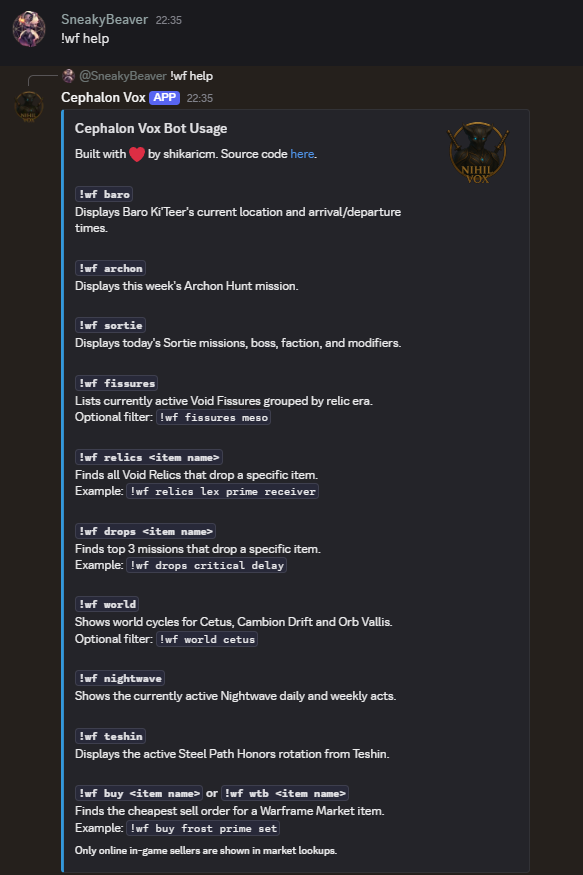
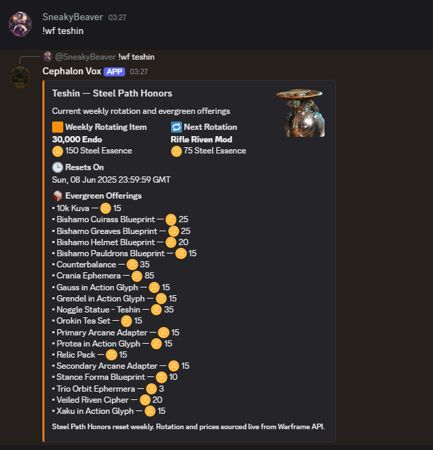
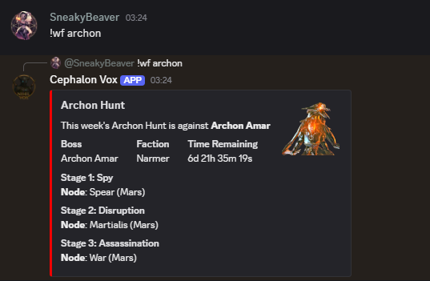
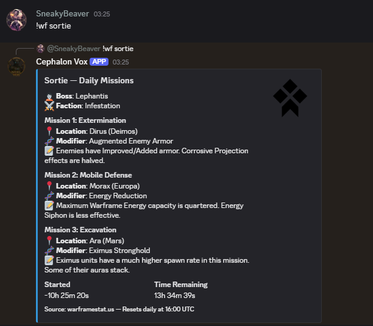
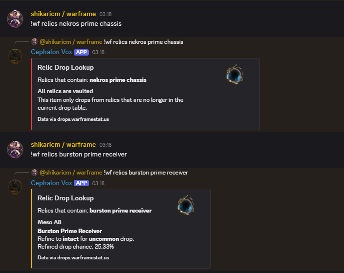

<p align="center">
  
</p>

# Warframe Discord Bot

A lightweight and modular Discord bot for tracking world states, Nightwave, Baro Ki'Teer, void fissures, and Warframe Market prices. Built with `discord.js` and TypeScript.

## Features

- **World Cycles**: Shows Cetus, Cambion Drift, and Orb Vallis world cycles.
- **Nightwave Alerts**: Shows daily and weekly acts and standing.
- **Baro Ki'Teer Status**: Displays current location and inventory.
- **Void Fissures**: Lists all active void fissures.
- **Market Lookups**: Finds the cheapest current in-game sell order for any item on [warframe.market](https://warframe.market).
- **Clan Prize Draw**: Restricted command for founding warlord to post prize draws.
- **Usage Command**: Provides interactive help message.

## Commands

Use the prefix `!wf` before all commands:



<p align="center">
  <table>
    <tr>
      <td align="center"><br/><code>!wf baro</code></td>
      <td align="center"><br/><code>!wf teshin</code></td>
      <td align="center"><br/><code>!wf wtb {item}</code></td>
    </tr>
    <tr>
      <td align="center"><br/><code>!wf world</code></td>
      <td align="center"><br/><code>!wf archon</code></td>
      <td align="center"><br/><code>!wf sortie</code></td>
      <td></td>
    </tr>
    <tr>
      <td align="center"><br/><code>!wf nightwave</code></td>
      <td align="center"><br/><code>!wf relics {item}</code></td>
      <td align="center"><br/><code>!wf prizedraw</code></td>
      <td></td>
    </tr>
  </table>
</p>

## Setup

### 1. Clone the repository

```bash
git clone https://github.com/yourusername/warframe-discord-bot.git
cd warframe-discord-bot
````

### 2. Install dependencies

```bash
npm install
```

### 3. Environment configuration

Create an `.env` file in the root:

```env
DISCORD_AUTH_TOKEN=your_discord_token
DISCORD_PREFIX=!wf
FOUNDING_WARLORD_USER_ID=your_user_id
CLAN_ICON=https://i.imgur.com/fQn9zNL.png
CLAN_ANNOUNCEMENTS_CHANNEL=clan_announcements_channel_id
WARFRAME_MARKET_API=https://api.warframe.market/v2
WARFRAME_API=https://api.warframestat.us/pc
```

> All channel/user IDs can be obtained in Discord by enabling Developer Mode.

## Running the Bot

```bash
npm run build && npm run bot
```

Use a process manager like `pm2` for background execution:

```bash
pm2 start dist/index.js --name "wf-bot"
```

## Requirements

* Node.js 18+
* Discord bot token
* Text channels with send/embed permissions

## License

[MIT](LICENSE)

<p align="center">
  
</p>